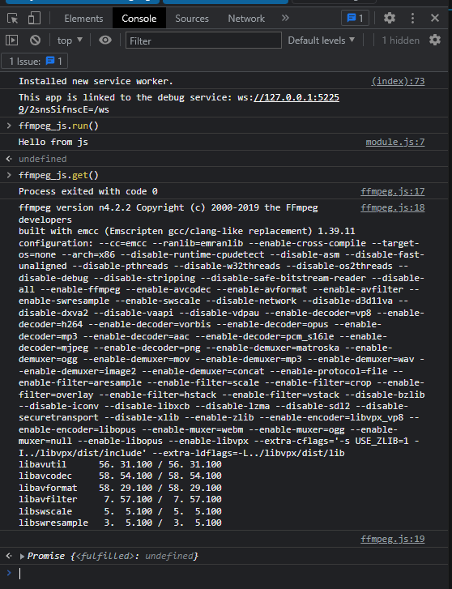

# dart call js

## simpl

## npm

### JS layer

open target folder 

init node module
`npm init -y`

install webpack
`npm install webpack webpack-cli --save-dev`

install npm package
`npm install {package} -y`

wrap your code to module

configure `webpack.config.js`

build webpack
`npx webpack build`

connect building lib to `index.html`
``

Check
- run flutter project
- open dev console(f12)
- call function by package name

### Dart layer

add [js lib](https://pub.dev/packages/js)

add bindings to js module

impl js and io variants

use))
